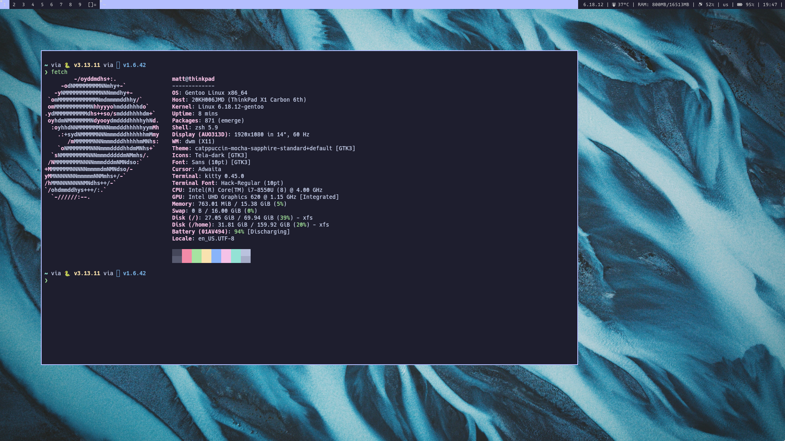
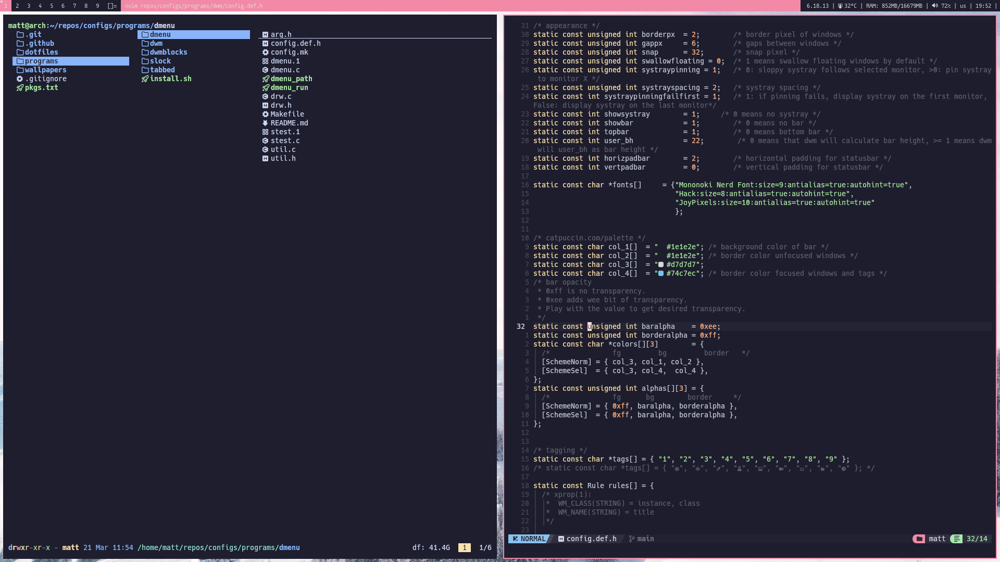
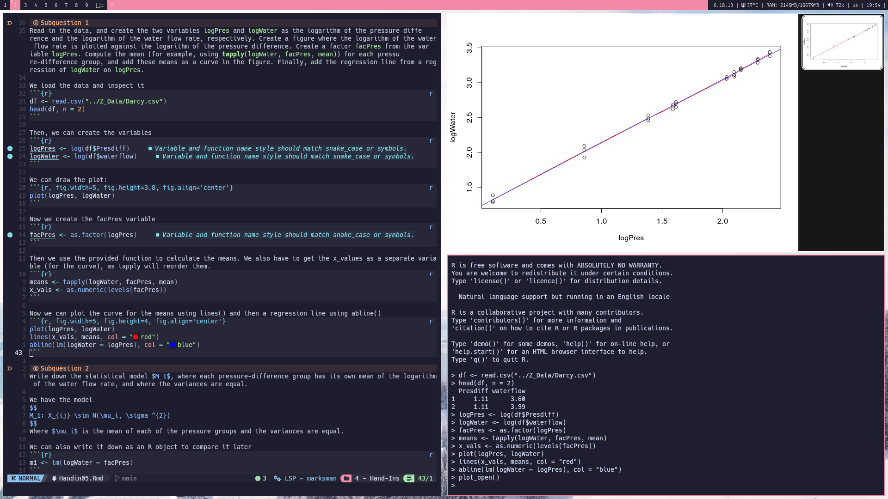

# configs / dotfiles
# About:
This repo serves as a backup for all my config file I use across all of my systems. Moreover, it is used to quickly deploy my work environment and allow me to get to work fast. My focus is to build a fast and effective system with minimal bloat and system overhead. Most included software is focused on a keyboard-centric workflow.
The repository is focused mainly on my linux systems (Gentoo / Arch), though some configurations for my mac system (mac-specific kitty.conf, .Rprofile, as well as a yabai and skhd configuration for occasional dynamic tiling) are also included.

# What is included? 

## dwm 
My heavily patched build of [dwm](https://dwm.suckless.org/), accompanied by suckless utilities ([dmenu](https://tools.suckless.org/dmenu/), [slock](https://tools.suckless.org/slock/), [tabbed](https://tools.suckless.org/tabbed/))

## Configs for:

### Neovim:
My main text editor of choice. Uses the [NvChad](https://nvchad.com/) standard distribution and is set up to work with Python, R, Quarto, .md - effectively replacing RStudio, Jupyter Notebooks and Obsidian [latex suite](https://github.com/artisticat1/obsidian-latex-suite) for my university needs. 

### lf 
as a primary terminal file manager, including utilities based on ([lfutils](https://github.com/demurky/lfutils)). Supports image and file previews and effective directory jumping in the shell using control + f

### R:
Integrating R with neovim, using httpgd + firefox to visualize plots. Allows me to fully replace the functionality of RStudio with a faster setup that also enables faster math typesetting in R markdown (using the aforementioned LuaSnip shortcuts).

### zsh
My main shell configuration, including scripting and aliases. Uses the [zsh-vi-mode](https://github.com/jeffreytse/zsh-vi-mode) plugin as well as [zsh-autosuggestions](https://github.com/zsh-users/zsh-autosuggestions) and [zsh-syntax-highlighting](https://github.com/zsh-users/zsh-syntax-highlighting). The main prompt is [starship](https://starship.rs/).

### dmwblocks 
The script-based taskbar, including custom shell scripts to monitor the system with minimal overhead.

### Others:
- a rather simple kitty configuration (my main terminal emulator)
- zathura as a pdf viewer that supports the vim keybinds to navigate
- xinitrc to launch X, in order to avoid the need of a login manager
- other small utilities (dunst, picom...)

# Installation:
- To install dotfiles, a deploy.sh script is used to create the necessary folders and then call gnu stow - the only dependency for this part of the installation. 
- To install the suckless software, use the install.sh script to install all utilities (with the bonus of being able to choose the main accent color). Here a make clean install is called, so no real dependency besides base-devel is needed.
- On Arch linux, most of the packages can be called using paru and passing the pkgs.txt file. Though be aware that some of the packages might be missing and need to be installed additionally. 

